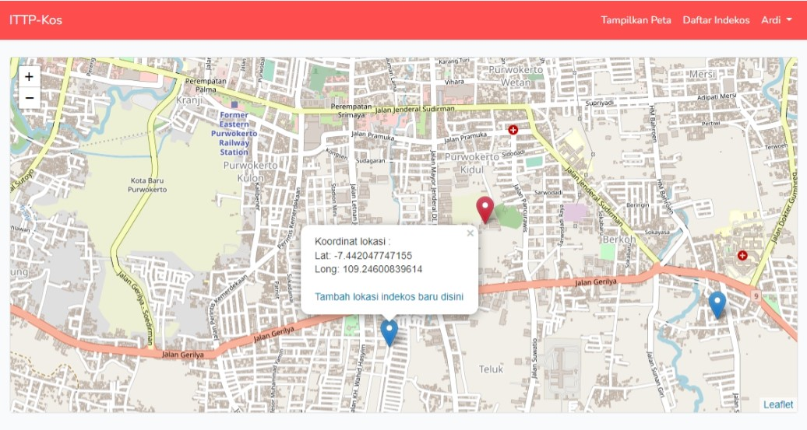

# Laravel Web Gis : Persebaran Indekos Disekitar Institut Teknologi Purowkerto

## Features

Dalam project ini, berisi manajemen lokasi atau koordinat dari indekos-indekos yang tersebar disekitar wilayah kampus Institut Teknologi Telkom Purwokerto. Project ini terdiri atas dua bagian website, yaitu bagian pengguna yang hanya menampilkan daftar indekos 

## Tahap Instalasi

Ikuti langkah berikut untuk menginstall project ini:

1. Clone atau unduh repository ini.
3.  `$ composer install`
5.  `$ php artisan key:generate`
6.  Set **database config** pada berkas `.env`
7.  `$ php artisan migrate`
8.  `$ php artisan serve`
10. Buka `https://localhost:8000` dengan web browser.

Untuk membuka halaman administrator dapat diakses melalui alamat berikut.
- Untuk Login : `https://localhost:8000/login`
- Untuk Register akun : `https://localhost:8000/register`

